# Reinforcement learning

## Sources
https://medium.com/@lgendrot/teaching-myself-reinforcement-learning-7b4157ee3b68


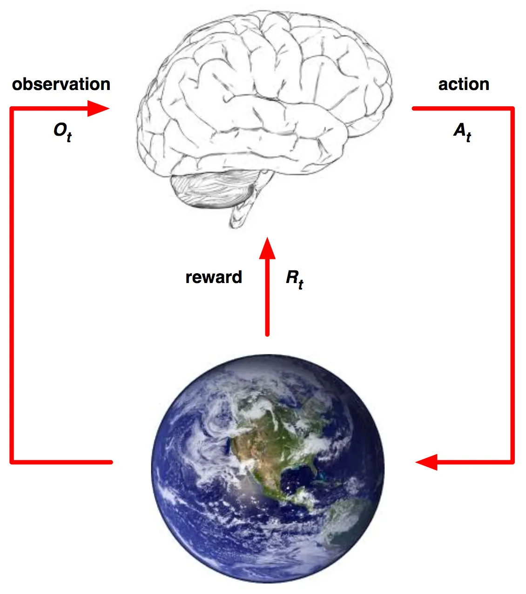

## Observations
Agents need to get information about the environment in order to make decisions on how to act. In the Atari example the observations might amount to screenshots of the game being played, the same as a human would see

## Agents
The agent receives observations of the environment, and uses those observations to select actions, which affects the environment and ultimately causes a reward signal to be given to the agent.


## States and the Markov Property
In the course of operation, the agent generates a “path” through an environment, which consists of sequential sets of observations, rewards, and next actions for each step the agent takes.

The history of an agent/environment pair includes all of the observations, rewards, and actions generated up to a particular point in time. 


It’s unnecessary to store the entire history of an agent -> concept of state. The state is formally just a function that produces a summary of the history up to a certain point.


The state can be thought of from both the perspective of the environment (environment state) and the agent (agent state, built entirely by the developer and by the algorithm used to solve the reinforcement learning problem.).

Ideally any state, being a summary of the history, would contain all the useful information about the history


**fully observable** environment, the agent state is the same as the environment state.

**partially observable** environment the agent state must be somehow computed from the history, since the observations are now incomplete representations of the environment


## Anatomy of a Reinforcement Learning Agent

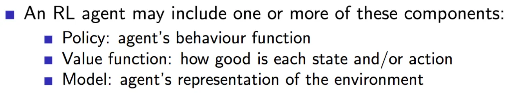


**Stochastic policy** outputs a probability distribution over actions which can be sampled from, again given a state

### Value function
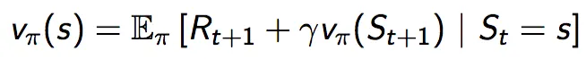

Estimate of how much future reward the agent can expect to receive if it is governed by our current policy.

Parameterized by a **discount** factor (gamma in the above formula)

## Model

“What’s going to happen next if I do this?”

Agent’s learned conception of how the environment works. Given a particular state and an action to take, the agent’s model will give it a prediction of the next state

Can also predict the reward given a state and action pair.


## Categories of agents


**policy based**, learning a policy directly without learning a value function.

**value based**, where it has no explicit policy, but instead learns a value function and acts based on its estimates. (Technically it still has an implicit policy: choose the best action).

**actor-critic**, having both a learned policy and an estimated value function for that learned policy.

## MDP
MDP, or Markov Decision Process : is the main formalism used in Reinforcement Learning


**fully observable MDPs** :  the current state that is given to the agent completely characterizes the environment. So the way in which the environment unfolds depends on some state, and we are told that state.”

**partially observed** can be converted to MDP and so behave largely the same way

Starting with:
Markov Chains >> Markov Reward Processes >>  Markov Decision Processes

### Markov chains


We don’t need to know the full history of states to know what will happen next, just the current one

State transition matrix, probability of transition from a state (row) to another one (col):


A Markov Chain has **no rewards or actions yet**, it simply defines a random process that generates a set of states, each with the Markov property


Student MDP:

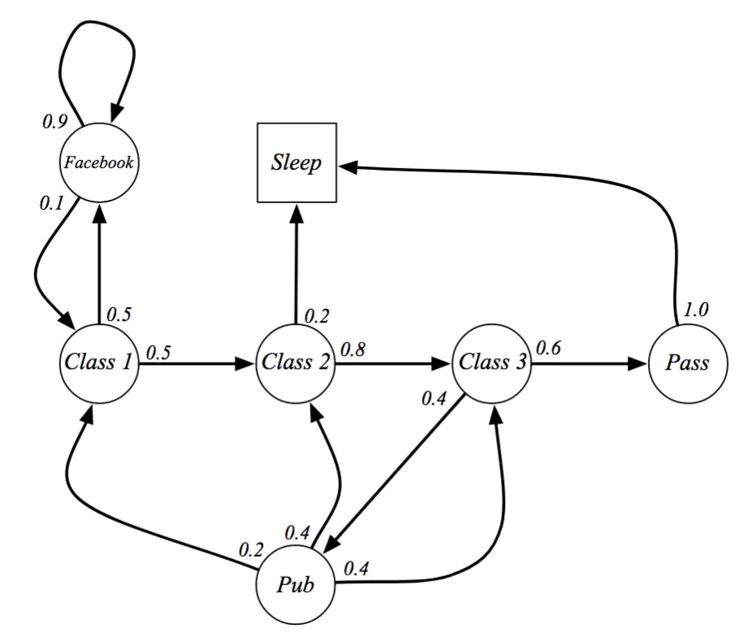

On can generate random set of states. Ex: ```['C1', 'C2', 'C3', 'Pub', 'C1', 'C2', 'Sleep']````
Agent make no decision, only at mercy of chance.  

### Markov Reward Processes
A Markov reward process is exactly like a Markov chain, except each step taken generates a reward.

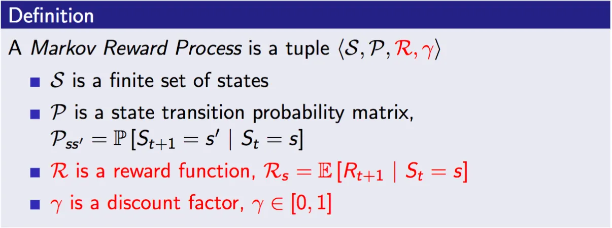

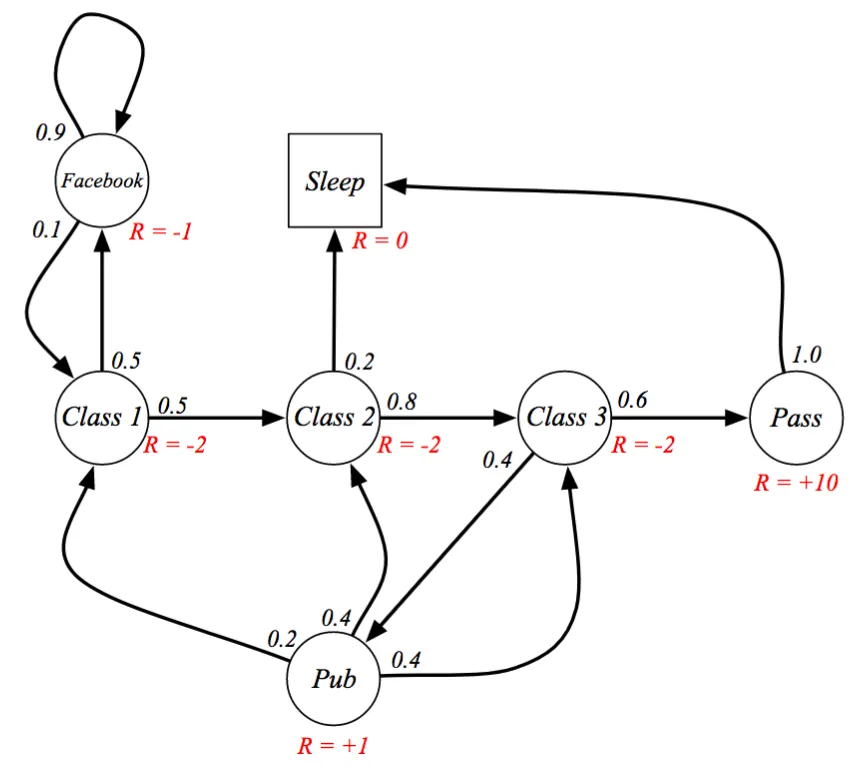

trajectories we sample will have an associated return value.

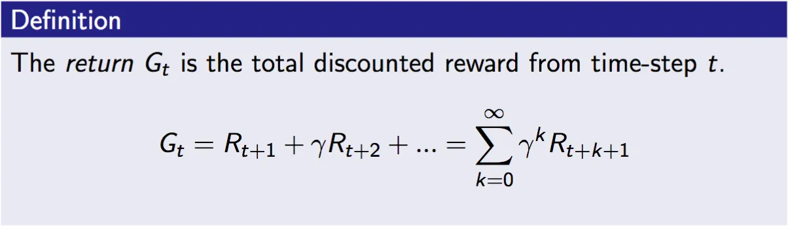

Gamma (0..1) determines how important future rewards are to the agent. if close to 0, consider immediate reward only.

Gamma=1 (for the rest of course for convenience)

Value function: expectation over future rewards 


Thanks to the law of large numbers, a rough estimate of the true value function for a state can be achieved by sampling many trajectories starting from that state, and averaging the sampled returns


### Bellman equation


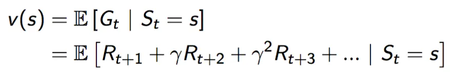

as gamma is constant:
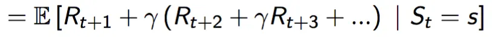
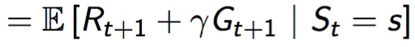


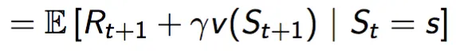

So : **value of a state s is the expectation over the immediate reward plus the discounted expected future reward***


#### How do we get that expected reward of the next state v(St+1)?

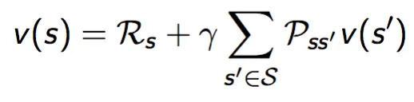

= sum of all state-values weighted by their probability of occurring. Many of the values in this sum will be zero, because you can only transition to some states at each step

Notice that the immediate reward is no longer expressed as an expectation because it’s a constant, and the expectation of a constant is just a constant, so we can pull it out of the expectation.

**Bellman equation** : expresses the state-value in terms of itself .

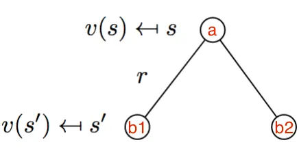

we’re taking the immediate reward r and then averaging over the values of all possible successor states

Self check with former value calculated iteratively:


Different way to solve it:

##### Analytical solution
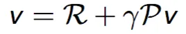


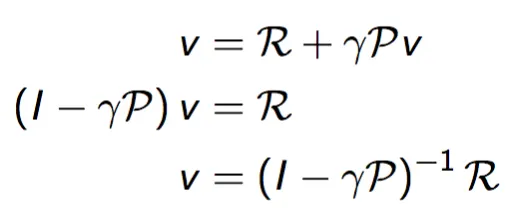

Often to large to be used

##### Iterative solutions

Do it later


### Markov Decision Processes (MDP)

It introduces actions. The inclusion of actions means that the transition probabilities as well as the rewards must now be **conditioned on a chosen action**

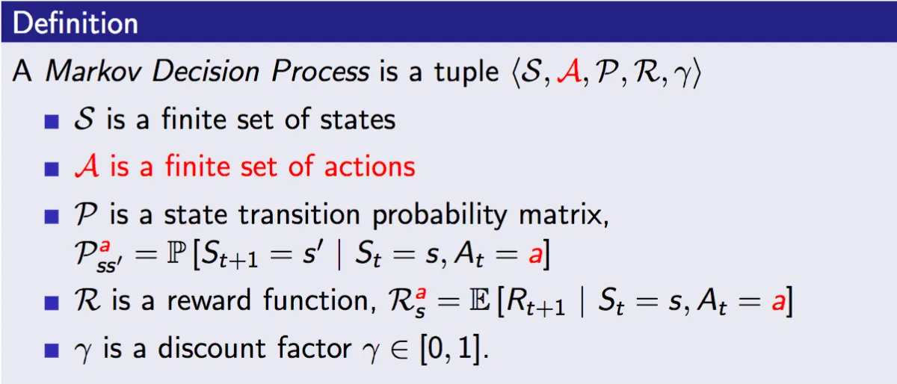

There is now a separate state transition matrix and reward for every action


For this particular MDP, every action save for “Pub” is deterministic. In the case of the action “ Pub”, the agent no longer enters into the “Pub” state, but instead transitions with some probability into one of the 3 “Class” states.

Why reduce the “Pub” state to an action instead? To show that actions can have both deterministic and stochastic effects on where the agent ends up in the environment.

we also don’t need the “Pass” state anymore. Whereas in the MC and MRP examples we only got rewards for exiting states, we now get rewards after taking actions, so we can get the +10 reward for studying in Class 3 without needing to transition into a “Pass” state that immediately takes us to “Sleep”

#### Policies

Agent policy:  a function that tells the agent what action to take depending on the state (or a probability distribution to sample from). Policy can also be deterministic (no sampling)


Later: Choosing a policy impacts value function. Calculate value function under many policies and select policy with better value.

##### Any MDP to MRP

We can reformulate any MDP into a MRP (which we know how to solve analytically). Change MDP to be action independent. 

The rewards in the MDP are conditioned on which action is taken, so we need to average over all actions from a single state to get a single action-independent reward value. Each state has an expected reward for any action


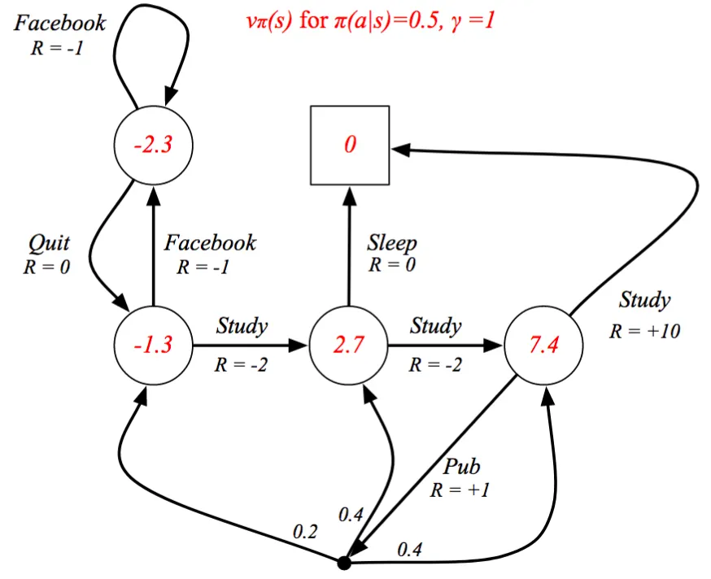


#### MDP Value Functions

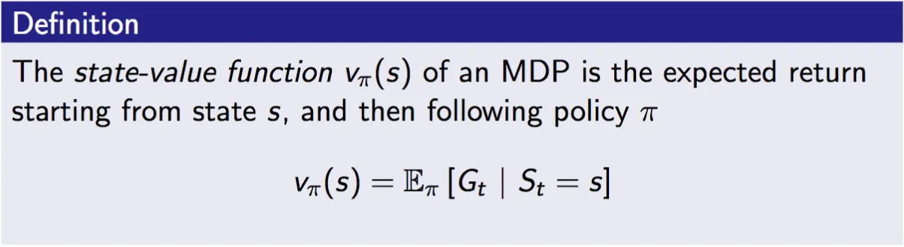

The state-value function tells us how much reward we can expect from the current state onward, if we follow the chosen policy.


we can use an average over many samples to estimate the action-value function

#### MDP Bellman Equation


They represent the same underlying value: the expected future reward


**States** = Open Circles; **Actions** = Closed Circles

State-value function is the average of all the available action-values, weighted by how likely we are to choose them under our current policy:

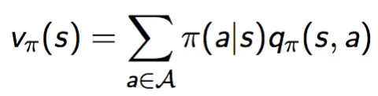

Similarly, the action-value function is the average value of the states the agent might transition to given the chosen action, but weighted instead by their transition probabilities


S=possible next states, P=transition probabilities

So action-value is the immediate reward for taking that action, plus the expected value of the next state, over all possible successor states
-----

Expand diagram to 2 steps to get MDP bellmann equation


---- 
also start from an action node:


And expand the action-value function by substituting in the state-value function:
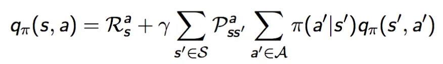

-----
SO we get the **value function in terms of itself**, giving us the **MDP Bellman Equation**.


It implements this formula:


### Optimal Value Functions


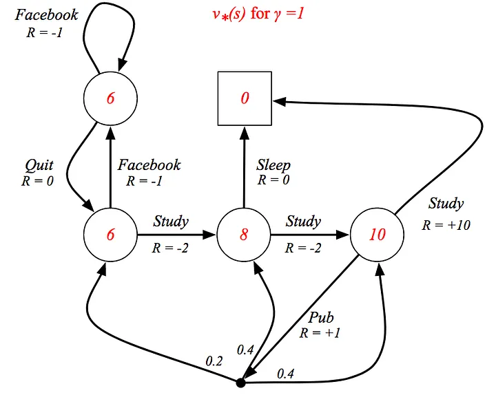


### Optimal policies


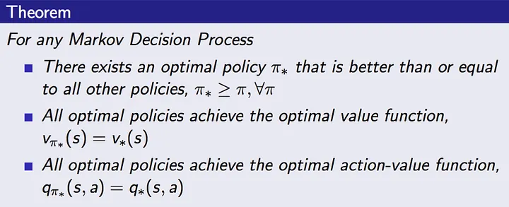

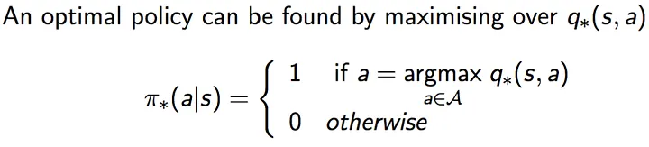

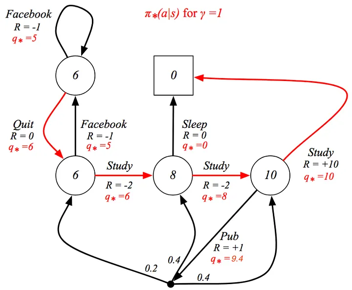

Finding The Optimal Action-Value Function

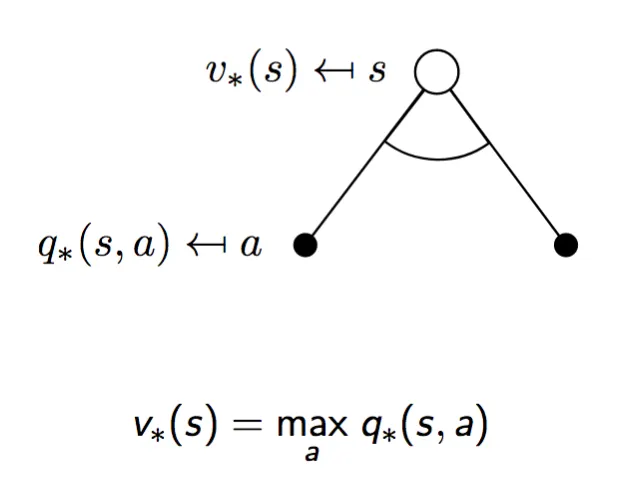


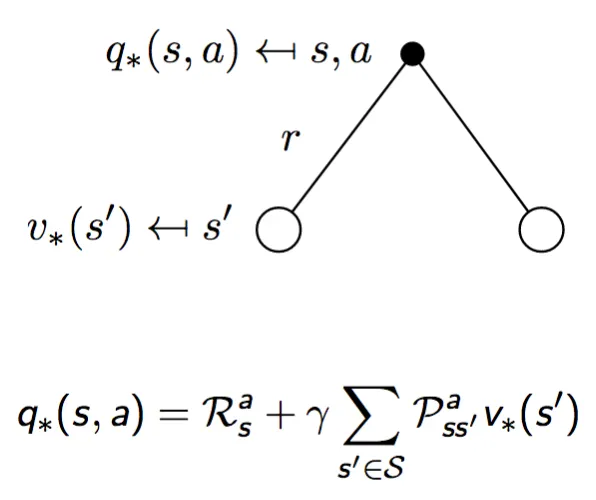

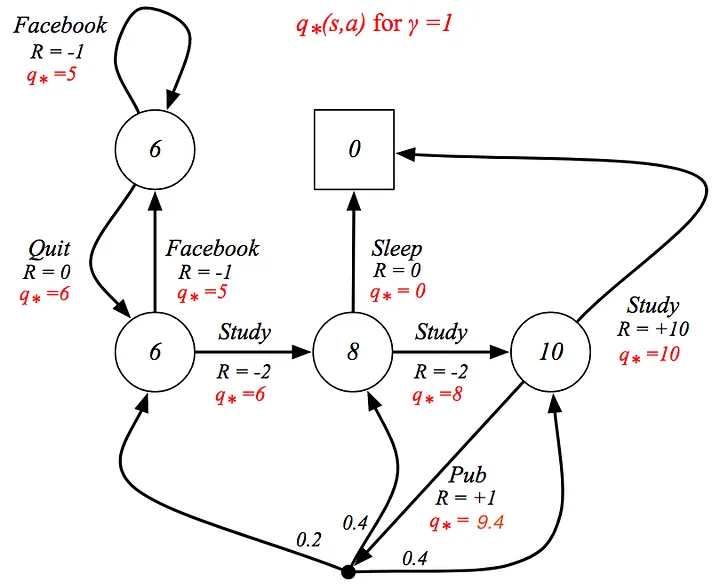


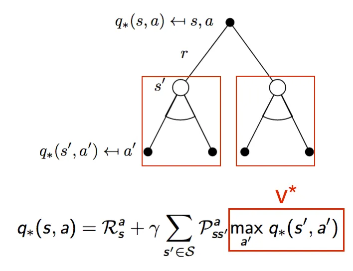

-----
Tabular data about state,... vs non tabular data